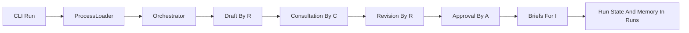

# Plan For MVP 03 Implementation

## Mål

Implementera ett första RACI-aware flöde enligt [D:\github\riniga\valuestream-os\functionality\mvp\03-raci-consultation-approval-and-informing.md](D:\github\riniga\valuestream-os\functionality\mvp\03-raci-consultation-approval-and-informing.md) ovanpå den befintliga orkestreringen från [D:\github\riniga\valuestream-os\functionality\mvp\02-agent-orchestration-framework.md](D:\github\riniga\valuestream-os\functionality\mvp\02-agent-orchestration-framework.md). Första implementationen ska verifiera ett BA-drivet `Kravställning`-flöde där minst en artifakt går igenom `draft -> consultation -> revision -> approval -> informing` och där all state/minne ligger transparent under `runs/<run-id>/`.

## Styrande filer

- [D:\github\riniga\valuestream-os\src\orchestration\process_loader.py](D:\github\riniga\valuestream-os\src\orchestration\process_loader.py): idag byggs steg primärt från SOP och `R`; behöver utökas så att RACI-data för vald artifakt kan bäras in i flödet.
- [D:\github\riniga\valuestream-os\src\orchestration\orchestrator.py](D:\github\riniga\valuestream-os\src\orchestration\orchestrator.py): huvudkandidaten för flerfasig körning och explicita gates.
- [D:\github\riniga\valuestream-os\src\framework\models.py](D:\github\riniga\valuestream-os\src\framework\models.py): behöver bära fler statusar och eventuellt steg-/artifaktmetadata för consultation, approval och informing.
- [D:\github\riniga\valuestream-os\src\framework\stores.py](D:\github\riniga\valuestream-os\src\framework\stores.py): utöka eller komplettera befintliga stores för konsultationsminne, beslutsminne och informerande briefs.
- [D:\github\riniga\valuestream-os\src\framework\context_loader.py](D:\github\riniga\valuestream-os\src\framework\prompt_builder.py): återanvänds för nya prompttyper i stället för att bygga speciallogik i varje agent.
- [D:\github\riniga\valuestream-os\src\orchestration\agent_registry.py](D:\github\riniga\valuestream-os\src\cli\run.py): nya roller behöver registreras och visas tydligt i CLI/status.
- [D:\github\riniga\valuestream-os\docs\RACI\RACI.md](D:\github\riniga\valuestream-os\docs\processes\1. Kravställning.md) och [D:\github\riniga\valuestream-os\docs\SOP\1.Kravställning(D:\github\riniga\valuestream-os\docs\SOP\1.Kravställning: fortsatt styrande källa för roller, processsteg och artifakter.

## Föreslagen implementation

## Stegvis genomförande

1. Lås första verifieringsflödet innan bred generalisering.
   Välj en konkret artifakt i `Kravställning` som har tydliga `C`, `A` och `I`-roller i [D:\github\riniga\valuestream-os\docs\RACI\RACI.md](D:\github\riniga\valuestream-os\docs\RACI\RACI.md). Planen bör utgå från exakt en artifakt först, så att orchestratorn kan utvecklas i små verifierbara steg.
2. Definiera run-lokala kontrakt för consultation, approval, informing och expertkontext.
   Skapa små, explicita filformat under `runs/<run-id>/` för konsultationsförfrågan, konsultationssvar, beslut och rollbriefs. Återanvänd befintliga `run_state.json`, `artifact_state.json` och `run_log.json` i stället för att introducera databas eller dold state.
3. Utöka domänmodeller och stores innan orkestreringen ändras.
   Börja i [D:\github\riniga\valuestream-os\src\framework\models.py](D:\github\riniga\valuestream-os\src\framework\models.py) och [D:\github\riniga\valuestream-os\src\framework\stores.py](D:\github\riniga\valuestream-os\src\framework\stores.py) så att systemet kan bära nya artifaktstatusar, konsultationsminne, approval-minne och informed-role-minne. Då kan resten av implementationen byggas ovanpå tydliga kontrakt.
4. Gör RACI-data operativ i loader-lagret.
   Utöka [D:\github\riniga\valuestream-os\src\orchestration\process_loader.py](D:\github\riniga\valuestream-os\src\orchestration\process_loader.py) så att den inte bara mappar `R` till `agent_id`, utan även kan koppla vald artifakt till `C`, `A` och `I` enligt dokumentationen. Håll första versionen strikt mot `Kravställning` och vald verifieringsartifakt om det minskar parsningsrisk.
5. Registrera de roller som behövs men håll agentbeteenden tunna.
   Utöka [D:\github\riniga\valuestream-os\src\orchestration\agent_registry.py](D:\github\riniga\valuestream-os\src\orchestration\agent_registry.py) med `produktägare`, `verksamhetsexperter`, `projektledare`, `lösningsarkitekt` och `utvecklare`. Återanvänd samma grundmönster för agentkörning via MAF-adaptern och lägg skillnader i prompt/context, inte i specialkod per roll.
6. Lägg till prompt- och contextstöd för varje fas.
   Utöka [D:\github\riniga\valuestream-os\src\framework\context_loader.py](D:\github\riniga\valuestream-os\src\framework\context_loader.py) och [D:\github\riniga\valuestream-os\src\framework\prompt_builder.py](D:\github\riniga\valuestream-os\src\framework\prompt_builder.py) med separata prompttyper för `consultation`, `revision`, `approval` och `informing`, samt enkel inläsning av run-specifik expertkontext. Det håller orchestratorn tydlig och bevarar capability-tänket från MVP 02.
7. Bygg flerfasig orkestrering med explicita gates.
   Uppdatera [D:\github\riniga\valuestream-os\src\orchestration\orchestrator.py](D:\github\riniga\valuestream-os\src\orchestration\orchestrator.py) så att ett logiskt steg kan köra delsteg i ordning: draft, consultation, revision, approval och informing. Första versionen bör fortfarande vara deterministisk och sekventiell; undvik dynamiska loopar eller generell workflow-motor i detta steg.
8. Lägg till run-specifik expertkontext som enkel capability.
   Använd [D:\github\riniga\valuestream-os\src\capabilities\run_workspace.py](D:\github\riniga\valuestream-os\src\capabilities\run_workspace.py) och `stores.py` för att skapa/läsa expertunderlag under aktuell run. Börja med explicit filbaserad kontext byggd från input-dokument och redan sparade konsultations- eller beslutssammanfattningar.
9. Håll CLI och status synliga för användaren.
   Utöka [D:\github\riniga\valuestream-os\src\cli\run.py](D:\github\riniga\valuestream-os\src\cli\run.py) så att användaren kan se vilka roller som deltar för en artifakt, vilken fas som pågår och vilka beslut/briefs som sparats. Behåll terminalflödet enkelt och undvik att introducera nya gränssnitt i MVP:n.
10. Verifiera med fokuserade tester och en manuell end-to-end-körning.
    Lägg tester främst där kontrakten är mest känsliga: loader/parsing, modeller/stores och orchestratorns fasövergångar. Avsluta med en manuell run som visar att vald artifakt produceras, konsulteras, godkänns och informeras med spårbara filer i `runs/<run-id>/`.

## Viktiga designval att hålla fast vid

- Behåll `runs/` som enda källa för runtime-minne; flytta inte run-specifik expertkunskap till `docs/`.
- Gör första versionen artifaktfokuserad och deterministisk innan du generaliserar till alla SOP:er och processsteg.
- Låt RACI styra orkestreringen, men håll själva agentimplementeringen tunn och återanvändbar.
- Bygg vidare på befintliga stores och modeller där det går, så att förändringen blir liten och reviewbar.

## Verifiering per etapp

- Etapp 1 är klar när de nya run-kontrakten är definierade och kan sparas/läsas isolerat.
- Etapp 2 är klar när loader och registry kan beskriva ett första RACI-aware steg för vald artifakt.
- Etapp 3 är klar när orchestratorn kan köra hela kedjan för en artifakt med rätt statusövergångar.
- Etapp 4 är klar när CLI/status och tester bekräftar spårbar körning utan manuell specialhantering i kod.
