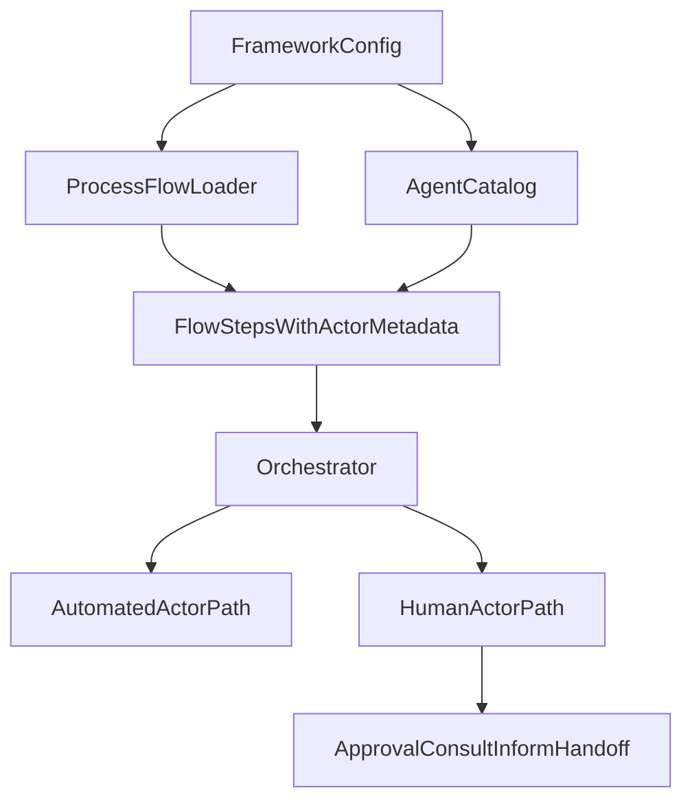

# Plan för balanserat framework och mänskliga roller

## Mål

Skapa en tydlig separation där innehåll och beroenden som hör till standarden ligger i frameworket, medan Python-koden endast laddar, validerar och orkestrerar detta. Samtidigt införs stöd för att en roll kan vara antingen automatisk eller mänsklig, så att exempelvis `Beställare` kan godkänna BA:s arbete utan att köras som LLM-agent.

## Antaganden

- Första planen utformas så att mänskliga roller kan stödjas generellt i `R`, `C`, `A` och `I`, även om `A` är det första prioriterade praktiska användningsfallet.
- Maskinläsbar sanning för roller/agenter flyttas till frameworket, och Python blir konsument + validator.
- `framework/standard/RACI/*.md` fortsätter vara dokumentation tills en explicit synk/validering införs; runtime ska fortsatt drivas av process + SOP + maskinläsbar frameworkkonfiguration.

## Nuläge som planen adresserar

- Agentmappning är idag hårdkodad i [D:/github/riniga/valuestream-os/src/orchestration/agent_registry.py](D:/github/riniga/valuestream-os/src/orchestration/agent_registry.py), trots att rollerna i praktiken definieras i frameworket.
- Det finns en konkret mismatch där `Beställare` mappar till `produktägare.md` i kod, medan frameworket innehåller [D:/github/riniga/valuestream-os/framework/standard/agents/beställare.md](D:/github/riniga/valuestream-os/framework/standard/agents/beställare.md).
- Orkestreringen saknar modell för `human` kontra `automated` aktör i [D:/github/riniga/valuestream-os/src/framework/models.py](D:/github/riniga/valuestream-os/src/framework/models.py), så alla roller behandlas som LLM-agenter.
- Processladdaren förutsätter att SOP-RACI alltid kan mappas mot registret, och använder skör substring-matchning från SOP till agent-id i [D:/github/riniga/valuestream-os/src/orchestration/process_loader.py](D:/github/riniga/valuestream-os/src/orchestration/process_loader.py).
- Processen [D:/github/riniga/valuestream-os/framework/standard/processes/1. Kravställning.md](D:/github/riniga/valuestream-os/framework/standard/processes/1.%20Kravställning.md) och SOP/RACI-dokumenten är inte fullt synkade kring vilka steg och ansvar som faktiskt ska orkestreras.

## Föreslagen målbild

1. Lägg all maskinläsbar roll-/agentdefinition i frameworket, till exempel under `framework/<variant>/agents/` eller i en separat manifestfil i frameworket.
2. Gör agentladdningen datadriven: orkestreringen läser frameworkets rollmanifest i stället för en hårdkodad Python-dict.
3. Utöka aktörsmodellen så att en roll kan vara `automated` eller `human`.
4. Låt orkestreringen välja exekveringsväg per rolltyp:
   - `automated`: nuvarande LLM-flöde
   - `human`: skapa vänteläge/handoff, begär underlag eller beslut, och återuppta när mänskligt svar finns
5. Inför validering vid uppstart som säkerställer att process, SOP, agentmanifest och agentfiler faktiskt hänger ihop.

## Arbetsplan

### 1. Definiera frameworkets maskinläsbara kontrakt

Inför en liten, tydlig manifeststruktur i frameworket för roller/agenter med minst:

- stabilt `role_id` eller `agent_id`
- visningsnamn/RACI-namn
- filreferens till rollbeskrivning
- `actor_kind` = `automated` eller `human`
- eventuellt vilka RACI-faser rollen får delta i

Detta bör bo nära frameworkinnehållet så att den nya standarden blir självbärande och inte kräver dold kunskap i Python-kod.

### 2. Synka namn och ansvar i standarden

Gå igenom standardens kravställningsdel och gör den internkonsistent:

- säkerställ att `Beställare` används konsekvent i agentfil, SOP och eventuell manifestpost
- rätta mismatchen mellan `produktägare` och `beställare`
- stäm av att `01_skapa_bestallning.md`, `02_sammanhallen_kravanalys.md` och RACI-matrisen beskriver samma ansvarsfördelning
- avgör om `Delprocess 1` ska återinföras i processfilen eller om dokumentationen ska anpassas till att flödet börjar vid dagens delprocess 2

Berörda filer: [D:/github/riniga/valuestream-os/framework/standard/SOP/1.Kravställning/01_skapa_bestallning.md](D:/github/riniga/valuestream-os/framework/standard/SOP/1.Kravställning/01_skapa_bestallning.md), [D:/github/riniga/valuestream-os/framework/standard/SOP/1.Kravställning/02_sammanhallen_kravanalys.md](D:/github/riniga/valuestream-os/framework/standard/SOP/1.Kravställning/02_sammanhallen_kravanalys.md), [D:/github/riniga/valuestream-os/framework/standard/RACI/1. Kravställning.md](D:/github/riniga/valuestream-os/framework/standard/RACI/1.%20Kravställning.md), [D:/github/riniga/valuestream-os/framework/standard/processes/1. Kravställning.md](D:/github/riniga/valuestream-os/framework/standard/processes/1.%20Kravställning.md).

### 3. Gör agentkatalogen datadriven i koden

Ersätt eller kapsla in [D:/github/riniga/valuestream-os/src/orchestration/agent_registry.py](D:/github/riniga/valuestream-os/src/orchestration/agent_registry.py) så att den läser från frameworkmanifestet i stället för att vara primär källa.

Planera även för striktare resolution än dagens substring-matchning i [D:/github/riniga/valuestream-os/src/orchestration/process_loader.py](D:/github/riniga/valuestream-os/src/orchestration/process_loader.py):

- exakt matchning mot deklarerat RACI-namn
- tydligt fel om flera eller inga roller matchar
- validering innan körning, inte först mitt i exekvering

### 4. Utöka datamodellen för mänskliga roller

Utöka modellerna i [D:/github/riniga/valuestream-os/src/framework/models.py](D:/github/riniga/valuestream-os/src/framework/models.py) så att både agentdefinition och steg/faser kan bära information om aktörstyp.

Minsta nivå i planen:

- `AgentDefinition.actor_kind`
- möjlighet att särskilja mänsklig godkännare/konsult/informerad roll i `FlowStep` och runtime-state
- tydlig status för väntande mänsklig åtgärd i run/artifact-state

### 5. Lägg till human-in-the-loop i orkestreringen

Planera en separat exekveringsväg i [D:/github/riniga/valuestream-os/src/orchestration/orchestrator.py](D:/github/riniga/valuestream-os/src/orchestration/orchestrator.py):

- om rollen är `automated`, använd nuvarande prompt/LLM-flöde
- om rollen är `human`, skriv inte prompt som om en modell ska svara, utan skapa ett handoff-steg med rätt underlag och invänta mänskligt svar

Första användningsfall:

- `Beställare` som mänsklig `A` för BA-producerat artefaktgodkännande

Därefter samma mekanik för:

- mänsklig `C` som lämnar feedback
- mänsklig `I` som får sammanfattning/notifiering
- mänsklig `R` om ett steg helt ska utföras manuellt

### 6. Definiera gränssnittet för mänsklig interaktion

Innan implementation behöver planen uttryckligen reservera en enkel integrationspunkt för mänskligt svar. Det kan initialt vara filbaserat eller state-baserat snarare än UI-tungt.

Planen bör därför omfatta:

- hur ett mänskligt approval request sparas
- hur ett beslut (`approve`, `approve_with_notes`, `reject`) representeras
- hur feedback kopplas tillbaka till nästa BA-revision
- hur en pausad körning återupptas utan att tappa kontext

### 7. Lägg till startup-validering för frameworkets integritet

Inför en valideringsrutin som kontrollerar att:

- alla roller i SOP-RACI finns i frameworkmanifestet
- alla manifestposter pekar på existerande agentfiler
- processfiler pekar på existerande SOP-filer
- outputs som ska bli steg också har mallar
- dokumenterade standardroller inte driver dolda beroenden från Python

Det minskar risken att systemet försöker ladda en agent som inte ska finnas.

### 8. Verifiera med ett avgränsat referensflöde

Använd kravställningsflödet som pilot:

- BA producerar artefakt
- Beställare är mänsklig godkännare
- feedback leder till revidering
- körningen kan fortsätta efter mänskligt beslut

Det ger snabb validering av den nya standardens kärna innan resten av frameworket justeras.

## Genomförandeordning

1. Definiera manifest och målkontrakt i frameworket.
2. Rätta standardens namn- och ansvarsmismatchar i kravställningsdelen.
3. Bygg läsning + validering av agentkatalog från frameworket.
4. Utöka modellerna för `human`/`automated`.
5. Inför human-in-the-loop för approval som första körbara scenario.
6. Generalisera till `C`, `I` och vid behov `R`.
7. Validera pilotflödet och därefter övriga processer.

## Viktiga risker att hantera i implementationen

- Om både SOP och separata RACI-matriser fortsatt underhålls manuellt finns risk för fortsatt drift mellan dokument och runtime.
- Om mänskliga roller införs utan paus/återupptagningsmodell kommer orkestreringen fortfarande vara i praktiken LLM-centrisk.
- Om namnkonventionen för roller inte stabiliseras nu kommer nya standarden fortfarande bära implicit koppling mellan dokument och kod.
