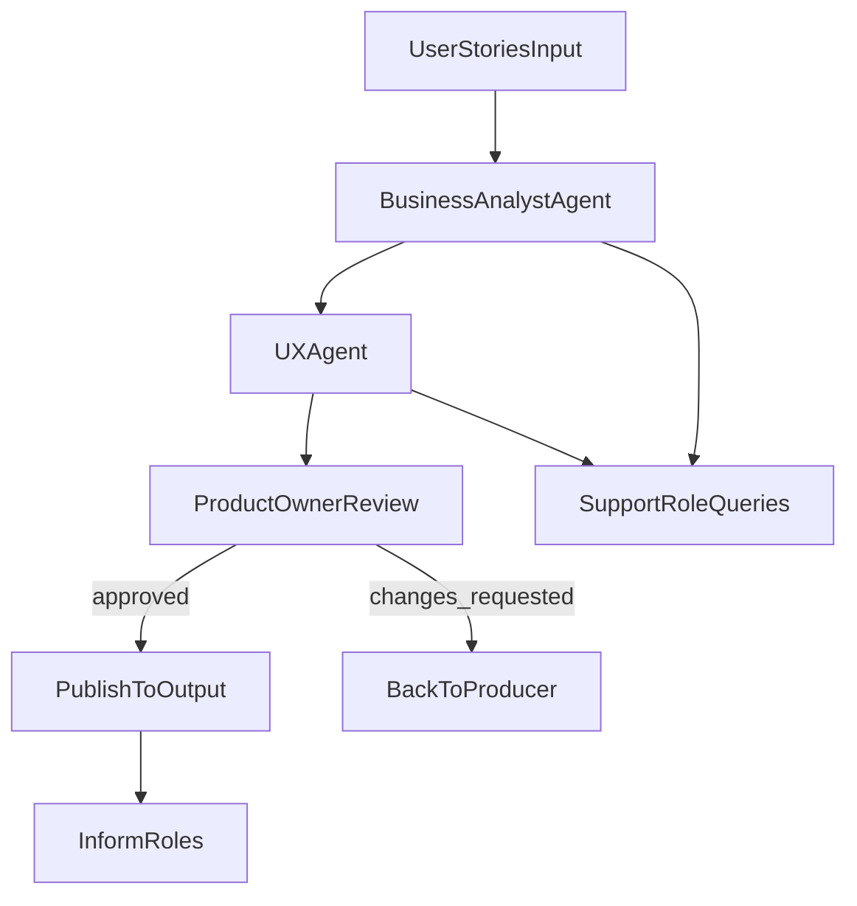

# Kravstallning Agent Orchestration Plan

## Goal

Build a first working Agent Orchestration Framework for only the Kravstallning process, where agents read input artifacts from `runs/`, execute SOP-defined transformations, and generate output artifacts in `runs/` through explicit Python orchestration (no workflow engine).

## Assumptions

- Framework source-of-truth already exists in `docs/` and must be consumed, not redesigned.
- Implementation lives in `src/`; runtime data lives in `runs/` and is never committed.
- First slice is deterministic, file-based, and synchronous.
- Core producers for this phase are Business Analyst and UX; Product Owner performs review/approval; support/inform roles are modeled as query/notification actions.
- Minimal state is JSON + Markdown under each run folder.

## Proposed file / folder structure

- Framework references (read-only inputs):
  - [D:/github/riniga/valuestream-os/docs](D:/github/riniga/valuestream-os/docs)
  - [D:/github/riniga/valuestream-os/setup/guidelines/framework-development-guidelines.md](D:/github/riniga/valuestream-os/setup/guidelines/framework-development-guidelines.md)
- Implementation (new/extended):
  - [D:/github/riniga/valuestream-os/src/orchestration/kravstallning_flow.py](D:/github/riniga/valuestream-os/src/orchestration/kravstallning_flow.py)
  - [D:/github/riniga/valuestream-os/src/orchestration/run_context.py](D:/github/riniga/valuestream-os/src/orchestration/run_context.py)
  - [D:/github/riniga/valuestream-os/src/orchestration/artifact_registry.py](D:/github/riniga/valuestream-os/src/orchestration/artifact_registry.py)
  - [D:/github/riniga/valuestream-os/src/agents/business_analyst_agent.py](D:/github/riniga/valuestream-os/src/agents/business_analyst_agent.py)
  - [D:/github/riniga/valuestream-os/src/agents/ux_agent.py](D:/github/riniga/valuestream-os/src/agents/ux_agent.py)
  - [D:/github/riniga/valuestream-os/src/agents/product_owner_reviewer.py](D:/github/riniga/valuestream-os/src/agents/product_owner_reviewer.py)
  - [D:/github/riniga/valuestream-os/src/roles/interaction_bus.py](D:/github/riniga/valuestream-os/src/roles/interaction_bus.py)
  - [D:/github/riniga/valuestream-os/src/cli/run_kravstallning.py](D:/github/riniga/valuestream-os/src/cli/run_kravstallning.py)
- Runtime workspace pattern:
  - [D:/github/riniga/valuestream-os/runs](D:/github/riniga/valuestream-os/runs)
  - `runs/<run_id>/input/` (seed files)
  - `runs/<run_id>/work/` (intermediate artifacts + state JSON)
  - `runs/<run_id>/output/` (final approved artifacts)
  - `runs/<run_id>/logs/` (step log and decision log)

## Step-by-step TODO list (very concrete)

1. Create run folder contract + state schema.

- Implement `RunContext` with path discovery (`input/work/output/logs`) and `state.json` lifecycle.
- Test: given `runs/demo-001/` with only `input/`, command initializes missing folders and writes `work/state.json` with `status=initialized`.

1. Implement artifact discovery and mapping.

- Build `artifact_registry.py` to map required Kravstallning input/output artifacts from SOP references in `docs/`.
- Test: given known input artifact filenames in `input/`, registry resolves next required output artifact IDs and target output paths.

1. Define minimal agent interfaces.

- Add a shared agent contract (`produce(input_artifacts, context) -> artifact_output`).
- Implement Business Analyst + UX agents as explicit SOP-step executors using templates from `docs/`.
- Test: given mock input Markdown, each agent generates expected output file with required headings.

1. Implement Product Owner decision step.

- Add reviewer that marks each produced artifact `approved` or `changes_requested` in `state.json`.
- Test: given generated artifact with missing section, reviewer writes `changes_requested` and blocks promotion to `output/`.

1. Add support-role query mechanism.

- Implement `interaction_bus.py` for `ask(role, question, context)` with file-backed responses (`work/qa_log.md` + `work/support_responses.json`).
- Roles: User Representatives, Project Manager, Developers, UX, Business Experts.
- Test: given an unresolved assumption, BA agent writes query and receives deterministic mock answer from role adapter.

1. Add inform-role notifications.

- Implement `inform(role, event, artifact_ref)` logging for BA, Solution Architect, Project Manager, Developers.
- Test: after PO approval, log entries are written for all inform roles in `logs/notifications.md`.

1. Orchestrate first explicit linear flow.

- Implement `kravstallning_flow.py` sequence:
  - load inputs -> BA produce -> UX refine/produce -> PO review -> publish approved outputs.
- No hidden branching except PO gate (`approved` vs `changes_requested`).
- Test: end-to-end run from seed User Stories input produces at least one approved downstream artifact in `output/`.

1. Add artifact lineage tracking.

- Persist per-artifact provenance in `work/lineage.json` (`source_files`, `produced_by`, `review_status`, `timestamp`).
- Test: each output artifact has lineage entry referencing upstream input artifact files.

1. Add CLI entrypoint.

- Implement `run_kravstallning.py --run-id <id> [--dry-run]`.
- Test: CLI returns non-zero on missing required input artifacts and clear message listing missing files.

1. Add minimal automated tests.

- Add tests for: run initialization, mapping resolution, agent output contract, PO gate behavior, and e2e happy path.
  - Test: local test command passes without external services.

1. Add minimal docs for usage.

- Document required run folder inputs, command invocation, and expected outputs/state files.
  - Test: new user can execute one run by following doc steps exactly.

1. Hardening pass (still simple).

- Add idempotency guard (re-run same step does not duplicate artifacts), clear errors, and deterministic file ordering.
  - Test: running same `run-id` twice produces stable outputs and no duplicate lineage entries.

## First minimal working scenario (example run)

- Create `runs/demo-001/input/user_stories.md` with 3-5 stories.
- Execute `python -m src.cli.run_kravstallning --run-id demo-001`.
- Expected behavior:
  - Initializes run state and folders.
  - BA agent reads `user_stories.md`, outputs next artifact draft to `work/`.
  - UX agent consumes BA output and writes its artifact draft.
  - PO reviewer marks artifacts approved.
  - Approved artifacts copied/moved to `output/`.
  - `work/lineage.json`, `logs/step_log.md`, and `logs/notifications.md` are generated.
- Acceptance check: "Given `user_stories.md` input -> at least one approved artifact appears in `output/` and has lineage + review status."

## Risks / open questions

- Exact filename conventions for each Kravstallning artifact in `runs/` must match existing templates in `docs/`; mismatch can break auto-discovery.
- SOP parsing may require a small explicit config if SOP headings are not fully standardized.
- Role interaction realism: initial implementation should use deterministic adapters/mocks to avoid external dependencies.
- PO approval criteria must be explicit (required headings/sections) to avoid subjective or unstable outcomes.
- Scope control: complete Kravstallning chain is large, so first shipped slice should guarantee one verified sub-chain before expanding to all artifacts.

