# Runtime Overview

This is the simplified architecture view for the implementation under `src/`.

Use this diagram when you want to explain the codebase without going into class members or method names.

## Focus

- CLI entrypoint
- markdown-driven flow loading
- orchestration runtime
- LLM boundary
- file-backed run state
- published output

## Simplified class diagram

```mermaid
classDiagram
    class CLI["CLI\nsrc/cli/run.py"]
    class RunWorkspace["RunWorkspace\nsrc/capabilities/run_workspace.py"]
    class Orchestrator["Orchestrator\nsrc/orchestration/orchestrator.py"]
    class ProcessFlowLoader["ProcessFlowLoader\nsrc/orchestration/process_loader.py"]
    class AgentRegistry["agent_registry\nsrc/orchestration/agent_registry.py"]
    class AgentContextLoader["AgentContextLoader\nsrc/framework/context_loader.py"]
    class ProcessFlow["ProcessFlow\nsrc/framework/models.py"]
    class FlowStep["FlowStep\nsrc/framework/models.py"]
    class PromptBuilder["FrameworkPromptBuilder\nsrc/framework/prompt_builder.py"]
    class AgentRunner["AgentRunner\nsrc/framework/maf_adapter.py"]
    class Stores["Run stores\nsrc/framework/stores.py"]
    class OutputIndex["output_index\nsrc/orchestration/output_index.py"]
    class FrameworkDocs["Framework markdown\nframework/standard/..."]
    class Runs["Run files\nruns/<run-id>/..."]

    CLI --> RunWorkspace : creates
    CLI --> ProcessFlowLoader : loads flow
    CLI --> Orchestrator : runs
    CLI --> Stores : status / human tasks

    ProcessFlowLoader --> AgentRegistry : loads agents
    ProcessFlowLoader --> AgentContextLoader : reads SOPs
    ProcessFlowLoader --> ProcessFlow : builds
    ProcessFlow --> FlowStep : contains

    AgentContextLoader --> FrameworkDocs : reads
    AgentRegistry --> FrameworkDocs : reads manifest

    Orchestrator --> RunWorkspace : uses run dirs
    Orchestrator --> ProcessFlow : executes
    Orchestrator --> PromptBuilder : builds prompts
    Orchestrator --> AgentContextLoader : loads context
    Orchestrator --> AgentRunner : calls LLM agent
    Orchestrator --> Stores : persists state
    Orchestrator --> OutputIndex : publishes output

    Stores --> Runs : writes JSON
    OutputIndex --> Runs : writes INDEX.md
    RunWorkspace --> Runs : reads / writes files
```

## How to talk through it

1. `CLI` starts the flow and points everything to a specific `run-id`.
2. `ProcessFlowLoader` turns framework markdown into executable `FlowStep` objects.
3. `Orchestrator` executes the loaded flow step by step.
4. `AgentRunner` is the LLM boundary behind the orchestration layer.
5. `stores.py` keeps run state transparent as JSON under `runs/<run-id>/`.
6. `output_index.py` publishes a readable `INDEX.md` over the generated output.

## Best companion files during a demo

- [`02-runtime-detail.md`](./02-runtime-detail.md)
- [`src/cli/run.py`](../../src/cli/run.py)
- [`src/orchestration/orchestrator.py`](../../src/orchestration/orchestrator.py)
- [`src/orchestration/process_loader.py`](../../src/orchestration/process_loader.py)
