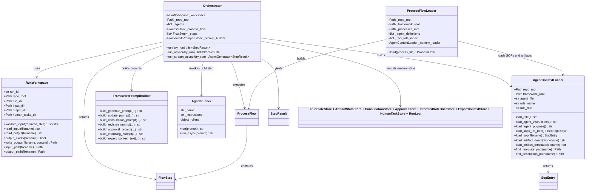

# Runtime Detail

This diagram adds selected attributes and methods for the core runtime classes.

Use it when you want to show how the orchestration is wired in code, not just conceptually.

## Scope

This is intentionally focused on the orchestration core:

- `RunWorkspace`
- `ProcessFlowLoader`
- `AgentContextLoader`
- `FrameworkPromptBuilder`
- `AgentRunner`
- `Orchestrator`

## Detailed class diagram

## Key explanation points

- `ProcessFlowLoader` is the bridge from markdown framework definitions to executable flow objects.
- `AgentContextLoader` reads role descriptions, SOPs, artifact templates and artifact descriptions from the framework.
- `FrameworkPromptBuilder` turns loaded framework context into prompts for different phases.
- `AgentRunner` isolates Microsoft Agent Framework and provider configuration behind one thin runtime boundary.
- `Orchestrator` is the composition root for execution, state updates, pauses and output publishing.

## Good source links to open beside this

- [`src/orchestration/orchestrator.py`](../../src/orchestration/orchestrator.py)
- [`src/orchestration/process_loader.py`](../../src/orchestration/process_loader.py)
- [`src/framework/context_loader.py`](../../src/framework/context_loader.py)
- [`src/framework/prompt_builder.py`](../../src/framework/prompt_builder.py)
- [`src/framework/maf_adapter.py`](../../src/framework/maf_adapter.py)
