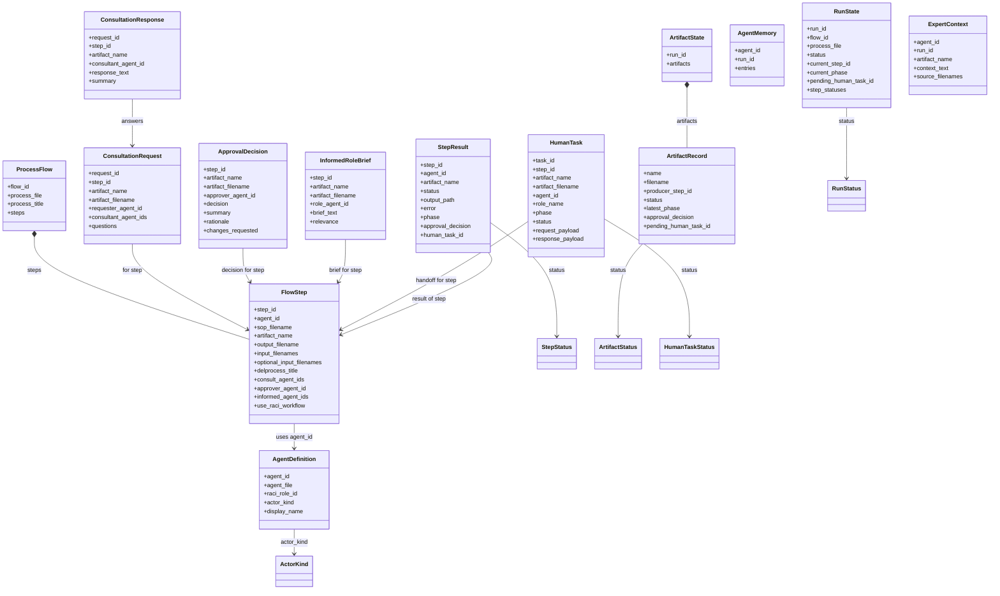

# Domain Models

This diagram focuses on the shared runtime contracts in `src/framework/models.py`.

Use it when the audience wants to understand what a run actually consists of in memory and on disk.

## Focus

- flow definition
- runtime state
- consultation / approval / informing
- human handoff
- per-step result

## Class diagram

## Reading guide

- `ProcessFlow` and `FlowStep` define what should happen.
- `RunState` and `ArtifactState` track where the current run is.
- `ConsultationRequest`, `ConsultationResponse`, `ApprovalDecision` and `InformedRoleBrief` make the RACI workflow explicit.
- `HumanTask` represents pauses where work must be completed by a person.
- `StepResult` is the result object emitted by the orchestrator while the flow runs.

## Main source

- [`src/framework/models.py`](../../src/framework/models.py)
