# Persistence and Output

This diagram shows how runtime state is persisted under `runs/<run-id>/` and how output is published for humans to inspect.

Use it when you want to explain traceability, transparency and replayability.

## Focus

- JSON-backed stores
- human-readable runtime files
- output index publishing
- relationship to `RunWorkspace`

## Class diagram

```mermaid
classDiagram
    class RunWorkspace {
        +run_id
        +run_dir
        +input_dir
        +output_dir
        +human_tasks_dir
        +write_output(filename, content)
    }

    class RunStateStore {
        +load()
        +save(state)
        +initialize(run_id, flow_id, step_ids, process_file)
    }

    class ArtifactStateStore {
        +load()
        +save(state)
        +initialize(run_id)
        +record_status(...)
        +record_produced(...)
        +record_failed(...)
    }

    class AgentMemoryStore {
        +load(agent_id, run_id)
        +save(memory)
        +set_entry(memory, key, value)
    }

    class ConsultationStore {
        +append_request(request)
        +append_response(response)
        +load_requests()
        +load_responses()
    }

    class ApprovalStore {
        +append(decision)
        +load()
        +load_for_step(step_id)
    }

    class InformedRoleBriefStore {
        +append(brief)
        +load()
        +load_for_step(step_id)
    }

    class ExpertContextStore {
        +save(context)
        +load(agent_id, run_id, artifact_name)
    }

    class HumanTaskStore {
        +save(task)
        +load(task_id)
        +load_all()
        +load_pending()
        +load_for_step_and_phase(step_id, phase, agent_id)
    }

    class RunLog {
        +append(entry)
        +load()
    }

    class OutputIndex["output_index.py"] {
        +publish_output_index(...)
        +build_output_index_content(...)
    }

    class PhaseCatalog
    class PhaseArtifact
    class ProcessFlowLoader

    class RunState
    class ArtifactState
    class AgentMemory
    class ConsultationRequest
    class ConsultationResponse
    class ApprovalDecision
    class InformedRoleBrief
    class ExpertContext
    class HumanTask
    class RunFiles["runs/<run-id>/..."]

    RunStateStore --> RunState
    ArtifactStateStore --> ArtifactState
    AgentMemoryStore --> AgentMemory
    ConsultationStore --> ConsultationRequest
    ConsultationStore --> ConsultationResponse
    ApprovalStore --> ApprovalDecision
    InformedRoleBriefStore --> InformedRoleBrief
    ExpertContextStore --> ExpertContext
    HumanTaskStore --> HumanTask

    RunWorkspace --> RunFiles : points to
    RunStateStore --> RunFiles : run_state.json
    ArtifactStateStore --> RunFiles : artifact_state.json
    AgentMemoryStore --> RunFiles : agent_memory_<id>.json
    ConsultationStore --> RunFiles : consultation_*.json
    ApprovalStore --> RunFiles : approval_decisions.json
    InformedRoleBriefStore --> RunFiles : informed_role_briefs.json
    ExpertContextStore --> RunFiles : expert_context.json
    HumanTaskStore --> RunFiles : human_tasks/*.json
    RunLog --> RunFiles : run_log.json

    OutputIndex --> RunWorkspace : reads output dir
    OutputIndex --> ProcessFlowLoader : builds phase catalog
    OutputIndex --> PhaseCatalog : groups output
    PhaseCatalog *-- PhaseArtifact : artifacts
    OutputIndex --> RunFiles : writes output/INDEX.md
```

## Key explanation points

- Runtime state is intentionally stored as readable files, not hidden in a database.
- Each store has a narrow responsibility and maps clearly to one JSON structure or file family.
- `HumanTaskStore` is special because it persists one task per JSON file for clear human handoff.
- `output_index.py` converts raw output files into a readable navigation layer for demos and inspection.

## Main source links

- [`src/framework/stores.py`](../../src/framework/stores.py)
- [`src/orchestration/output_index.py`](../../src/orchestration/output_index.py)
- [`src/capabilities/run_workspace.py`](../../src/capabilities/run_workspace.py)
