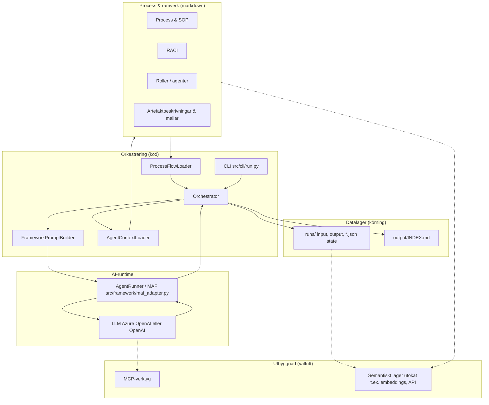
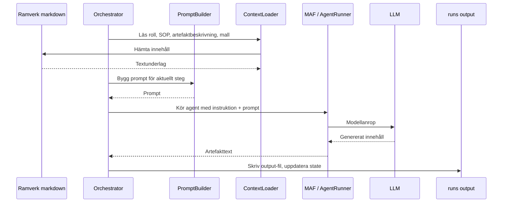

# AI-arkitektur och datalager

Detta dokument kompletterar de övriga arkitekturdiagrammen med en **AI-vy**: hur orkestrering, roller/agenter, LLM och data hänger ihop, och var i repot respektive del lever idag.

## Syfte

- ge en **enhetlig bild** för presentation: från process och ramverk till körning och modell
- visa **koppling till kod och ramverk** med konkreta sökvägar
- skilja på det som **finns i repot nu** och det som är en **naturlig utbyggnad** (till exempel MCP, vektorlager, externa datakällor)

## Logiska lager

| Lager | Vad det är | I detta repo idag | Typisk utbyggnad |
| --- | --- | --- | --- |
| **Process & ramverk** | Verksamhetslogik som text: processsteg, SOP, RACI, roller, artefaktbeskrivningar och mallar | [`framework/standard/`](../../framework/standard/) (t.ex. [`INDEX.md`](../../framework/standard/INDEX.md), processfiler, SOP, [`agents/manifest.json`](../../framework/standard/agents/manifest.json)) | Fler varianter under `framework/`, versionsstyrda ramverksändringar |
| **Orkestrering** | Laddar ramverket till körbara steg, driver flöde, pausar för människa, sparar state | [`src/orchestration/orchestrator.py`](../../src/orchestration/orchestrator.py), [`process_loader.py`](../../src/orchestration/process_loader.py), [`agent_registry.py`](../../src/orchestration/agent_registry.py), [`output_index.py`](../../src/orchestration/output_index.py), CLI [`src/cli/run.py`](../../src/cli/run.py) | Fler transportsätt än CLI, API, events |
| **Agenter / roller** | Rolldefinitioner och instruktioner som matas in i prompts; kan vara automatiserade eller mänskliga | [`framework/standard/agents/*.md`](../../framework/standard/agents/), manifest [`manifest.json`](../../framework/standard/agents/manifest.json); valfria tunna wrappers t.ex. [`src/agents/ux/agent.py`](../../src/agents/ux/agent.py) | Fler rollimplementationer, specialiserade agenttyper |
| **Prompt & kontext** | Samlar rolltext, SOP, artefaktbeskrivning, mall och input till en välformulerad uppgift | [`src/framework/context_loader.py`](../../src/framework/context_loader.py), [`src/framework/prompt_builder.py`](../../src/framework/prompt_builder.py) | Dynamisk kontexttrimning, policylager, säkerhetsfilter |
| **LLM & modell** | Anrop till språkmodell via valbar leverantör | [`src/framework/maf_adapter.py`](../../src/framework/maf_adapter.py), [`setup/environment/.env.example`](../../setup/environment/.env.example), [`environment.yml`](../../environment.yml) (`agent-framework`, `openai`) | Fler providers, routing per steg, kostnadsspårning |
| **Verktyg (MCP)** | Standardiserat sätt för agenter att anropa externa system och API:er | *Ej implementerat i detta repo* (inga MCP-referenser i kodbasen) | MCP-servrar mot ärendesystem, wiki, metrics, källkodsindex |
| **Semantiskt lager** | Begrepp, definitioner och **meningsfull struktur** så att modellen och människor delar samma språk | Primärt **markdown-ramverket**: [`GLOSSARY.md`](../../framework/standard/GLOSSARY.md), artefaktbeskrivningar, processvokabulär; plus **körningsoutput** som indexeras manuellt | Ontologi i graf-DB, embedding-index, enterprise glossary API |
| **Datalager** | Var sanningen om en körning och dess artefakter lever | **Filbaserat**: input/output under `runs/<run-id>/`, JSON state/logg (se [`src/framework/stores.py`](../../src/framework/stores.py)); ramverksmallar under `framework/` | Objektlager, DB, audit store; separat datarepo enligt er modell |

## Översiktsdiagram: från ramverk till modell och tillbaka till artefakter

## Sekvens: ett steg från prompt till artefakt

## Koppling till kod och ramverk (snabb referens)

| Komponent | Roll | Var i repot |
| --- | --- | --- |
| Ramverket | Definierar *vad* som ska göras och *vilka* roller som gör det | [`framework/standard/`](../../framework/standard/) |
| Manifest | Kopplar RACI-roll till agentfil | [`framework/standard/agents/manifest.json`](../../framework/standard/agents/manifest.json) |
| Stegbyggare | Processmarkdown + SOP → `FlowStep` | [`src/orchestration/process_loader.py`](../../src/orchestration/process_loader.py) |
| Orkestrator | Kör steg, RACI-faser, paus för människa, sparar state | [`src/orchestration/orchestrator.py`](../../src/orchestration/orchestrator.py) |
| Prompt | Formulerar uppgiften till modellen | [`src/framework/prompt_builder.py`](../../src/framework/prompt_builder.py) |
| LLM-gräns | MAF + providerval via miljövariabler | [`src/framework/maf_adapter.py`](../../src/framework/maf_adapter.py), [`.env.example`](../../setup/environment/.env.example) |
| Spårbarhet | JSON + markdown under run | [`src/framework/stores.py`](../../src/framework/stores.py), [`src/orchestration/output_index.py`](../../src/orchestration/output_index.py) |

## Hur du pratar om det i en presentation

1. **Ramverket är sanningen om processen** — kod och agenter ska följa det som står i `framework/standard`.
2. **Orkestreringen är motorn** — den läser ramverket och gör det körsteg för steg.
3. **LLM är en kapabilitet** — den producerar innehåll inom de ramar SOP och mall ger.
4. **runs är minnet för en körning** — allt ska gå att följa utan att gissa vad modellen gjorde.
5. **MCP och ett rikt semantiskt lager** är naturliga nästa steg när ni vill koppla till fler system och göra retrieval och begrepp förstklassiga — men det är inte en del av den minimala kärnan i detta repo ännu.

## Relaterade diagram

- [`01-overview.md`](./01-overview.md) — runtime-översikt
- [`04-persistence-and-output.md`](./04-persistence-and-output.md) — filbaserat state och output-index
